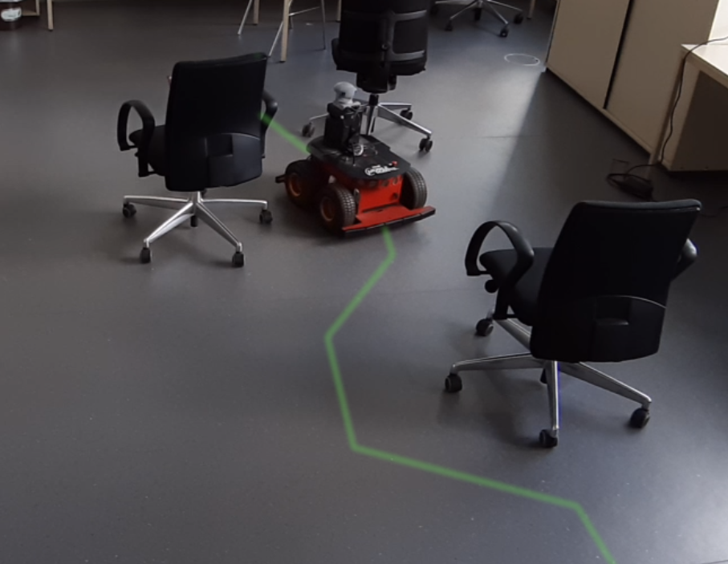

# Code of the ICRA 2020 paper *Gershgorin Loss Stabilizes the Recurrent Neural Network Compartment of an End-To-End Robot Learning Scheme*

Official code repository of the paper *Gershgorin Loss Stabilizes the Recurrent Neural Network Compartment of an End-To-End Robot Learning Scheme* by Mathias Lechner, Ramin Hasani, Daniela Rus, and Radu Grosu, published at ICRA 2020.



## Requirements

The code is implemented using python3.6 and TensorFlow 1.14.0.
Running the HalfCheetah experiments requires a valid MuJoCo license.

## Structure

- The folder ```cheetah``` contains the training data for the HalfCheetah experiment
- The folder ```training_data``` contains the training data for the obstacle avoidance imitation learning experiment
- ```ctrnn_imitator.py``` Implementation of the CT-RNN
- ```lstm_imitator.py``` Implementation of LSTM
- ```lds_imitator.py``` Implementation of the Linear Dynamical System
- ```train_cheetah.py``` Main file for running the HalfCheetah experiment
- ```train_imitator.py``` Main file for training the obstacle avoidance agent

## Example usage

```bash
python3 train_imitator.py --model lstm --real
```

The ```--model`` option defines the RNN model. Possible values are

- **lstm** for an LSTM
- **ctrnn** for a CT-RNN
- **linear** for a LDS *without* Gershgorin Loss stabilization
- **lds** for a LDS *with* Gershgorin Loss stabilization

The ```--real``` argument defines if there should be a separate test set, i.e., 
if the flag is set, all the data will be used for training and validation (there is no test set).
The actual test was perform on the real robot (see picture above)

## Bibtex

```bibtex
@inproceedings{lechner2020gershgorin,
  title={Gershgorin Loss Stabilizes the Recurrent Neural Network Compartment of an End-To-End Robot Learning Scheme},
  author={Lechner, Mathias and Hasani, Ramin and Rus, Daniela and Grosu, Radu},
  booktitle={2020 International Conference on Robotics and Automation (ICRA)},
  year={2020},
  organization={IEEE}
}
```